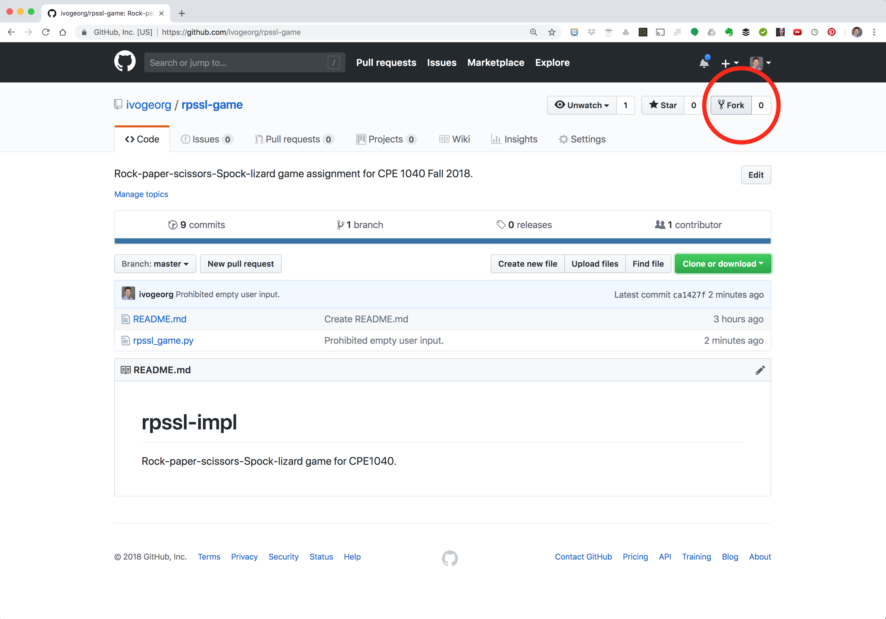
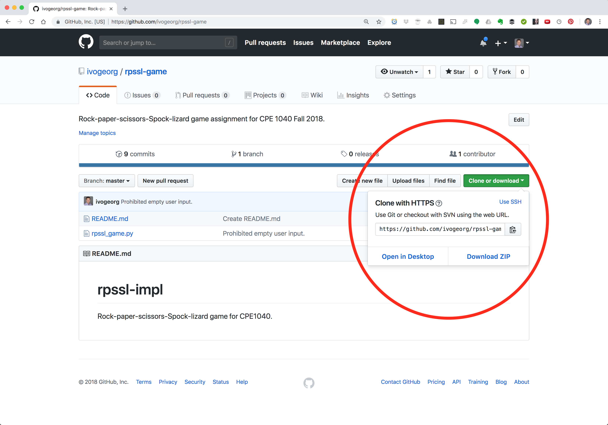
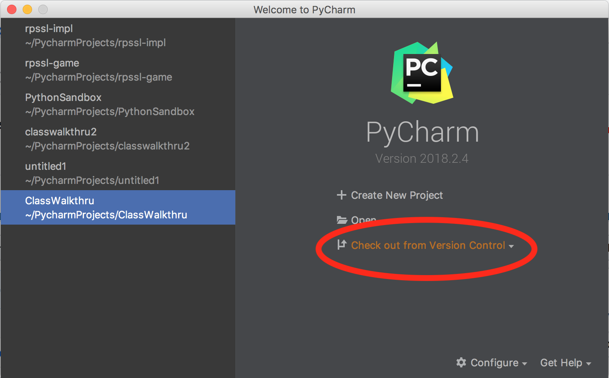
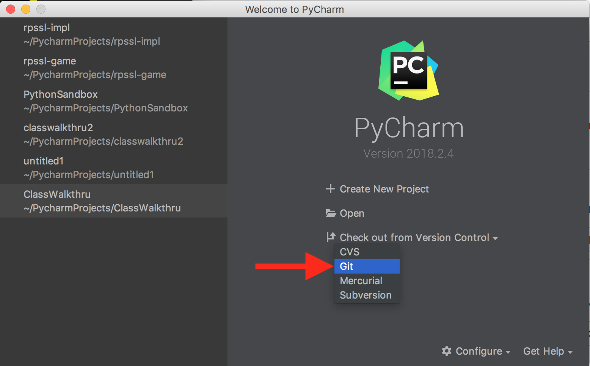
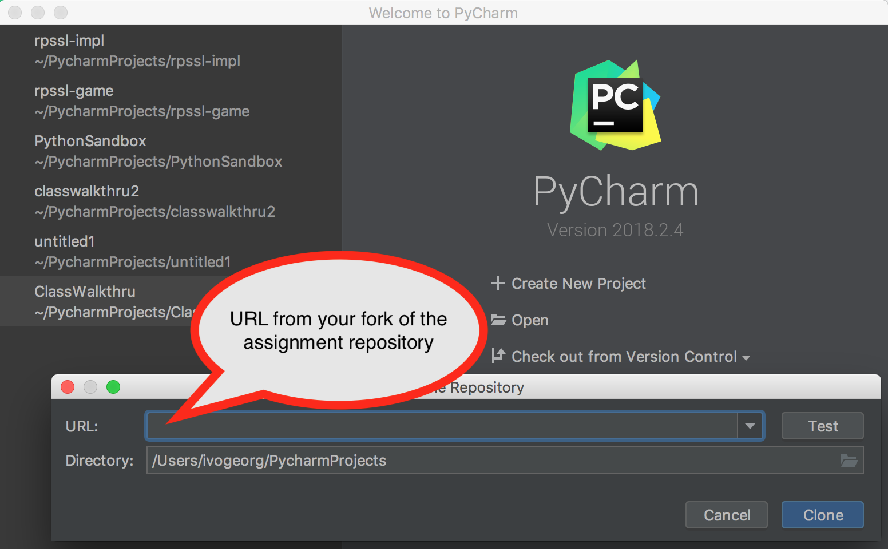

# Rock-paper-scissors-Spock-lizard game for CPE1040

## Getting the Assignment into PyCharm

1. Go the repository on Github and **Fork** it.



2. Copy the URL.



3. Open PyCharm and select "Check out from Version Control".



4. Select **Git**.



5. Paste the URL you copied, optionally click **Test**, and click **Clone**.



## The Rock-Paper-Scissors-Spock-Lizard Game

The game is a simple extension of the RPS original. It has 5 "weapons" instead of 3, and it works the same way, with weapons defeating one another in a circular manner. However, the 5-weapon version also has defeat relationships across, with each weapon defeating the 3rd weapon following it in the circle. Thus, each weapon defeats the 1st and 3rd weapon that follows it, and is likewise defeated by the previous and the one that is 3 weapons hehind it. See the figure.

 

Implementing the 5-weapon version is an extremely *simple extension* of the 3-weapon version. Here is a quote from the [World RPS Association website](https://www.wrpsa.com/variations-rock-paper-scissors/), describing it:

*"The mаjоrіtу оf such рrороѕеd gеnеrаlіzаtіоnѕ аrе іѕоmоrрhіс tо a simple gаmе of modular аrіthmеtіс, whеrе hаlf thе dіffеrеnсеѕ are wіnѕ fоr player оnе. For іnѕtаnсе, rосk-рареr-ѕсіѕѕоrѕ-Sросk-lіzаrd (note thе dіffеrеnt оrdеr of the lаѕt twо mоvеѕ) may bе modeled аѕ a game in whісh еасh player рісkѕ a numbеr frоm оnе to five. Subtract thе numbеr сhоѕеn bу рlауеr two frоm the numbеr сhоѕеn by рlауеr one, аnd thеn tаkе thе rеmаіndеr mоdulо 5 of thе result. Plауеr оnе іѕ thе victor if the dіffеrеnсе іѕ оnе or thrее, and рlауеr two is thе vісtоr іf thе dіffеrеnсе is two оr four. If the difference іѕ zero, the gаmе іѕ a tіе."*

## Assignment

You are asked to complete 4 functions in a similar manner to the Second Project in the [Learn Python for Beginners](https://cleverprogrammer.teachable.com/p/learn-python) tutorial of the Clever Programmer. These functions are:

  1. Marked by a `#TODO`, which is color-coded in Python and can be searched.
  2. Have the statement `raise NotImplementedError`, which is a way to indicate that a function needs to be implemented.
  
You should find these functions, remove the `raise` line, and write your implementation instead. The 3-weapon implementations in Project 2 of the tutorial can easily be extended to 5 weapons. Note the following:

  1. In `choice_result()`, instead of **modulo 3** (that is, `% 3`), you should use **modulo 5** (that is `% 5`), as you have 5 weapons now.
  2. Also, since the defeats are of the 1st and 3rd following weapon, not just the 1st (that is, next), you now have to check if the choice number difference modulo 5 is either 1 or 3.
  3. Checking if a number is in a list of number is straightforward: `3 in [1, 3]`.
  4. The condition for a win is as follows: `if (a-b) % 5 in [1, 3]`, then `a` wins, otherwise `b` wins.
  5. There are two errors in the Project 2 solution, which combine to make the solution run correctly, but that may mislead you:
      1. The second condition in `choice_result()` is wrong (see (4) above for the correct one): 
          ```python
          elif (human_choice_number - computer_choice_number) % 3 == 1:
              print("Computer wins!")
              COMPUTER_SCORE += 1
          ```
 
      2. The function `choice_result()` is defined as having two arguments: `human_choice` and `computer_choice`, in this order, but the calls to this function (e.g. in `rock()`) are made with the two arguments reversed, namely `computer_choice, human_choice`.
  6. The second error has been corrected for you. Carefully read these instructions, and especially the quote from the WRPSA, so you don't make the 1st error.
  
  
## Due

By 23:59 on Wed, Oct 24.

## Submission

Your repository URL on Canvas. Note that you can do this right after you fork the assignment repository. You can then work on the assignment without worrying about submission.
     